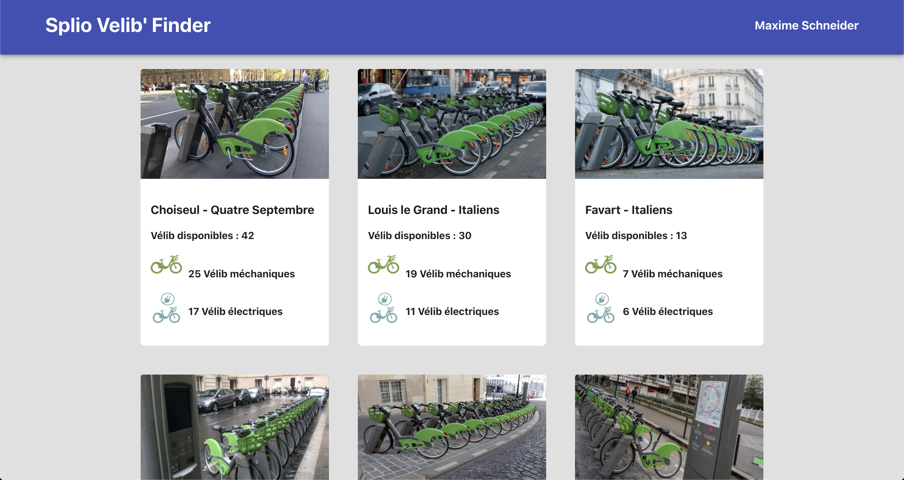

# Velib Finder Frontend 

The goal of this project is to allows Splio employees to know the number of available Velib of nearby stations the headquarters.

### Run 

To launch the front end, please run : 
```npm start```

### Desired result 
Hopefully it's the same on your screen and mine ;) 




